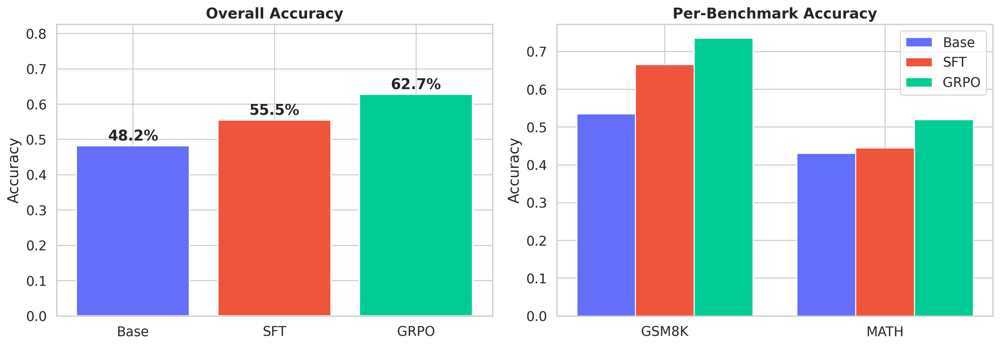
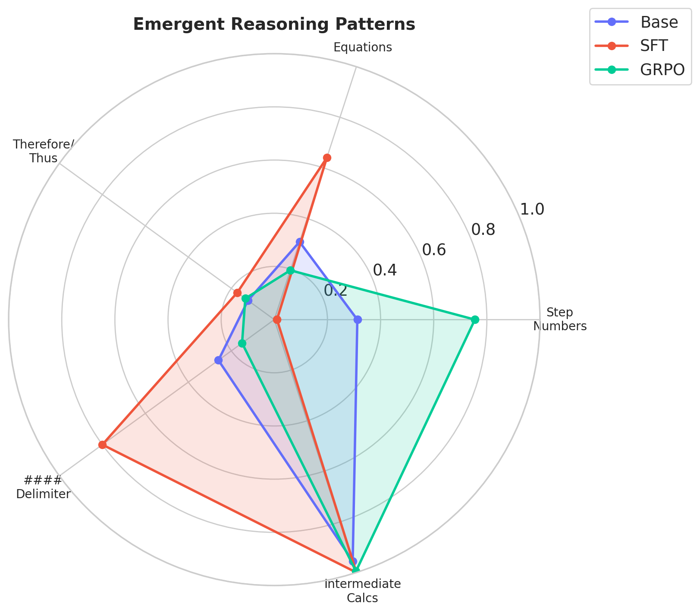
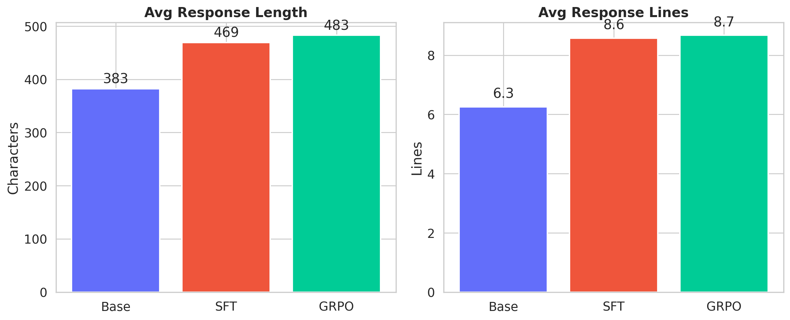

# Emergent Reasoning via GRPO

**Reproducing DeepSeek-R1's emergent chain-of-thought reasoning through pure reinforcement learning, without supervised reasoning traces.**

<p align="center">
  
</p>

<p align="center">
  
  
</p>

## Key Results

| Model | Overall Accuracy | GSM8K | MATH | Step-by-Step Reasoning |
|:------|:---:|:---:|:---:|:---:|
| Base (Qwen2.5-3B) | 48.3% | 53.5% | 43.0% | 31.2% |
| SFT (Supervised Fine-Tuning) | 55.5% | 66.5% | 44.5% | 1.0% |
| **GRPO (Ours)** | **62.8%** | **73.5%** | **52.0%** | **75.5%** |

> **GRPO outperforms SFT by +7.3% overall while developing structured step-by-step reasoning entirely through reinforcement learning** -- no supervised reasoning traces were used during training.

## Overview

This project validates a central claim from [DeepSeek-R1](https://arxiv.org/abs/2501.12948): that **chain-of-thought reasoning can emerge purely from reinforcement learning** with outcome-based rewards, without requiring any supervised reasoning demonstrations.

We train Qwen2.5-3B using **Group Relative Policy Optimization (GRPO)** -- a variant of PPO that eliminates the need for a separate critic network by computing advantages relative to a group of sampled completions. The model receives only a binary correctness reward (plus a small format bonus) and develops structured mathematical reasoning as an emergent behavior.

### What is GRPO?

Standard RLHF uses PPO with a learned value function (critic) to estimate advantages. GRPO instead:

1. **Samples a group** of G completions for each prompt
2. **Scores each completion** using a reward function (correctness + format)
3. **Computes relative advantages** within the group: $A_i = \frac{r_i - \mu_G}{\sigma_G}$
4. **Optimizes the policy** using a clipped surrogate objective with KL regularization

This removes the need to train a separate critic model, reducing memory by ~50% and enabling RL fine-tuning on consumer hardware.

```
                    ┌────────────────────────────────────┐
                    │         GRPO Training Loop         │
                    └────────────────────────────────────┘
                                     │
                    ┌────────────────┴────────────────┐
                    ▼                                 ▼
             ┌─────────────┐                  ┌─────────────┐
             │   Prompt    │                  │   Policy    │
             │  (GSM8K)    │                  │  (Qwen2.5)  │
             └──────┬──────┘                  └──────┬──────┘
                    │                                │
                    │     Generate G completions      │
                    │◄───────────────────────────────►│
                    │                                │
              ┌─────┴──────────────┐                 │
              │  c₁, c₂, ..., c_G │                 │
              └─────┬──────────────┘                 │
                    │                                │
              ┌─────┴──────┐                         │
              │  Reward    │   r_i = correct(c_i)    │
              │  Function  │   + λ·format(c_i)       │
              └─────┬──────┘                         │
                    │                                │
              ┌─────┴──────────────────────┐         │
              │  Group Relative Advantage  │         │
              │  A_i = (r_i - μ) / σ       │         │
              └─────┬──────────────────────┘         │
                    │                                │
                    │     Policy gradient update      │
                    └───────────────────────────────►│
```

## Emergent Reasoning Example

**Prompt:** *A store sells notebooks for $3 each. If you buy 5 or more, you get a 20% discount. How much would 7 notebooks cost?*

**GRPO Model Response (no supervised reasoning traces used in training):**

```
To calculate the cost of 7 notebooks with a 20% discount, we can follow these steps:

1. Calculate the total cost without the discount:
   Total cost without discount = Number of notebooks × Price per notebook
   Total cost without discount = 7 × $3
   Total cost without discount = $21

2. Calculate the discount amount:
   Discount amount = Total cost without discount × Discount percentage
   Discount amount = $21 × 20%
   Discount amount = $21 × 0.20
   Discount amount = $4.20

3. Subtract the discount amount from the total cost without discount:
   Final cost = Total cost without discount - Discount amount
   Final cost = $21 - $4.20
   Final cost = $16.80

####16.80
```

The model learned to:
- Break problems into numbered steps
- Show intermediate calculations explicitly
- Label quantities clearly
- Use the `####` delimiter for the final answer

**None of these behaviors were taught through supervised examples** -- they emerged purely from the RL optimization signal.

## Project Structure

```
emergent-reasoning-via-grpo/
├── configs/
│   └── default.yaml                # All hyperparameters and settings
├── src/grpo_reasoning/
│   ├── data/
│   │   └── dataset.py              # GSM8K/MATH loading, answer extraction
│   ├── models/
│   │   └── reward.py               # Correctness + format reward functions
│   ├── evaluation/
│   │   └── metrics.py              # Accuracy, pass@k, reasoning analysis
│   └── utils/
│       └── config.py               # Configuration management
├── scripts/
│   ├── download_data.py            # Download and cache datasets
│   ├── train_grpo.py               # GRPO training (main experiment)
│   ├── train_sft.py                # SFT baseline training
│   ├── evaluate.py                 # Multi-model evaluation pipeline
│   ├── generate.py                 # Generate example reasoning traces
│   └── visualize.py                # Create publication-quality plots
├── tests/
│   └── test_reward.py              # 31 unit tests for rewards/extraction
├── results/                        # Evaluation outputs and plots
├── checkpoints/                    # Model checkpoints (LoRA adapters)
└── logs/                           # Training and evaluation logs
```

## Technical Details

### Model Configuration

| Parameter | Value |
|:---|:---|
| Base Model | Qwen/Qwen2.5-3B (1.7B parameters) |
| Quantization | 4-bit NF4 (QLoRA) |
| LoRA Rank | 64 |
| LoRA Alpha | 128 |
| LoRA Target Modules | All attention + MLP projections |
| Trainable Parameters | 119.7M (7.05% of total) |

### GRPO Training

| Parameter | Value |
|:---|:---|
| Group Size (G) | 8 completions per prompt |
| Max Completion Length | 512 tokens |
| KL Coefficient (beta) | 0.04 |
| Clipping Range (epsilon) | 0.2 |
| Learning Rate | 5e-6 (cosine schedule) |
| Effective Batch Size | 8 (1 × 8 grad accumulation) |
| Training Steps | 500 |
| Training Time | ~2.75 hours on RTX 4090 |

### Reward Function

```python
reward = correctness_weight * correct(completion, answer)
       + format_weight * format_score(completion)
```

- **Correctness** (weight=1.0): Binary 1/0 based on extracted numerical answer match
- **Format** (weight=0.1): Partial credit for multi-line work, numerical steps, `####` delimiter, and reasoning before the answer

### SFT Baseline

| Parameter | Value |
|:---|:---|
| Learning Rate | 2e-5 |
| Batch Size | 16 (4 × 4 grad accumulation) |
| Max Sequence Length | 1,536 tokens |
| Training Steps | 1,404 |
| Final Loss | 0.462 |
| Training Time | ~29 minutes on RTX 4090 |

### Benchmarks

- **GSM8K** (Grade School Math): 200 test problems evaluated with greedy decoding
- **MATH** (Competition Mathematics): 200 test problems across 7 subject areas (algebra, geometry, number theory, counting & probability, precalculus, intermediate algebra, prealgebra)

## Detailed Results

### Accuracy Breakdown

| Benchmark | Base | SFT | GRPO | GRPO vs Base |
|:---|:---:|:---:|:---:|:---:|
| GSM8K | 53.5% | 66.5% | **73.5%** | +20.0% |
| MATH | 43.0% | 44.5% | **52.0%** | +9.0% |
| **Overall** | 48.3% | 55.5% | **62.8%** | **+14.5%** |

### Emergent Reasoning Patterns

| Pattern | Base | SFT | GRPO |
|:---|:---:|:---:|:---:|
| Step Numbers (1., 2., ...) | 31.2% | 1.0% | **75.5%** |
| Mathematical Equations | 30.8% | **64.0%** | 19.5% |
| Therefore/Thus/Hence | 12.2% | **17.2%** | 13.5% |
| #### Answer Delimiter | 26.0% | **80.0%** | 15.0% |
| Intermediate Calculations | 95.5% | **100%** | 99.5% |
| Avg Response Length (chars) | 383 | 469 | **483** |
| Avg Response Lines | 6.3 | 8.6 | **8.7** |

**Key Insight:** GRPO develops its own reasoning style that differs from SFT. While SFT copies the GSM8K training format (equations with `<<>>` markers, `####` delimiter), **GRPO independently discovers numbered step-by-step reasoning** (75.5% vs 31.2% base) as an optimal strategy for the correctness reward.

### Training Metrics

| Metric | SFT | GRPO |
|:---|:---:|:---:|
| Final Loss | 0.462 | 0.00065 |
| Training Steps | 1,404 | 500 |
| Training Time | 29 min | 2.75 hrs |
| Token Accuracy | 91.4% | -- |

## Reproducing Results

### Prerequisites

- NVIDIA GPU with >= 16GB VRAM (tested on RTX 4090 24GB)
- CUDA 12.1+
- Conda or Miniconda

### Setup

```bash
# Clone the repository
git clone https://github.com/A-SHOJAEI/emergent-reasoning-via-grpo.git
cd emergent-reasoning-via-grpo

# Create conda environment
conda create -n grpo python=3.11 -y
conda activate grpo

# Install dependencies
pip install -r requirements.txt
```

### Training

```bash
# 1. Download datasets (GSM8K + MATH)
python scripts/download_data.py

# 2. Train SFT baseline (~30 min on RTX 4090)
python scripts/train_sft.py

# 3. Train GRPO model (~3 hours on RTX 4090)
python scripts/train_grpo.py
```

### Evaluation

```bash
# Evaluate all three models
python scripts/evaluate.py \
  --eval-base \
  --sft-adapter checkpoints/sft_*/final \
  --grpo-adapter checkpoints/grpo_*/final \
  --max-samples 200

# Generate reasoning traces
python scripts/generate.py \
  --adapter checkpoints/grpo_*/final \
  --label grpo

# Create visualization plots
python scripts/visualize.py
```

### Running Tests

```bash
python -m pytest tests/ -v
# 31 tests, all passing
```

## Configuration

All hyperparameters are centralized in `configs/default.yaml`. Key settings:

```yaml
# Model
model:
  name: "Qwen/Qwen2.5-3B"
  quantization: "4bit"

# GRPO Training
grpo:
  num_generations: 8          # Group size for relative advantage
  max_completion_length: 512  # Max tokens per completion
  temperature: 0.7            # Sampling temperature
  beta: 0.04                  # KL penalty coefficient
  epsilon: 0.2                # PPO-style clipping range
  learning_rate: 5.0e-6
  max_steps: 500

# Reward
reward:
  correctness_weight: 1.0     # Binary correctness reward
  format_weight: 0.1          # Structured reasoning bonus
```

## Dependencies

| Package | Version |
|:---|:---|
| PyTorch | 2.6.0+cu124 |
| Transformers | 5.2.0 |
| TRL | 0.28.0 |
| PEFT | 0.18.1 |
| BitsAndBytes | 0.49.2 |
| Datasets | Latest |

## References

1. **DeepSeek-R1** - [DeepSeek-R1: Incentivizing Reasoning Capability in LLMs via Reinforcement Learning](https://arxiv.org/abs/2501.12948)
2. **GRPO** - [DeepSeekMath: Pushing the Limits of Mathematical Reasoning in Open Language Models](https://arxiv.org/abs/2402.03300)
3. **GSM8K** - [Training Verifiers to Solve Math Word Problems](https://arxiv.org/abs/2110.14168)
4. **MATH** - [Measuring Mathematical Problem Solving With the MATH Dataset](https://arxiv.org/abs/2103.03874)
5. **QLoRA** - [QLoRA: Efficient Finetuning of Quantized Language Models](https://arxiv.org/abs/2305.14314)

## License

MIT License - see [LICENSE](LICENSE) for details.
